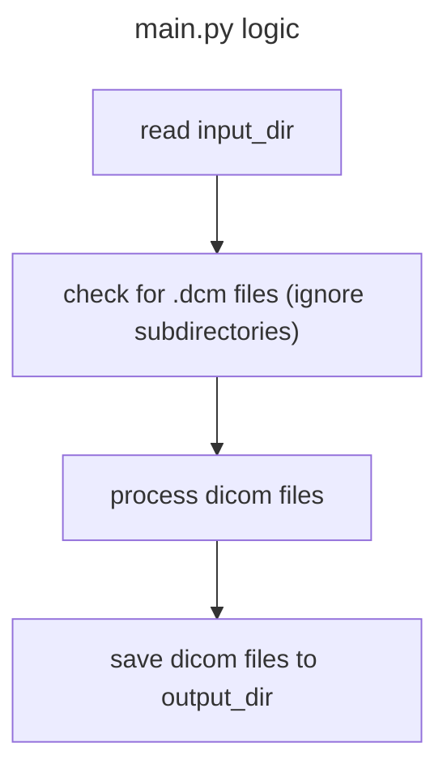

# Hello world DICOM

Sample containerised PyTorch application for processing DICOM files, compatible with the Newton's Tree Platform (NTP).



## 1. Define your Dockerfile

See [Dockerfile](Dockerfile).

## 2. Build your container

```bash
version=0.2.1
docker build -t hello-world:$version .
```

## 3. Test your container

> You can test your container locally before deployment:

The paths in the container `/tmp/in` and `/tmp/out` are mounted locally in this example as `dicom/in` and `dicom/out`:

```bash
docker run --rm \
  -v $(pwd)/dicom/in:/tmp/in \
  -v $(pwd)/dicom/out:/tmp/out \
  hello-world:$version
```