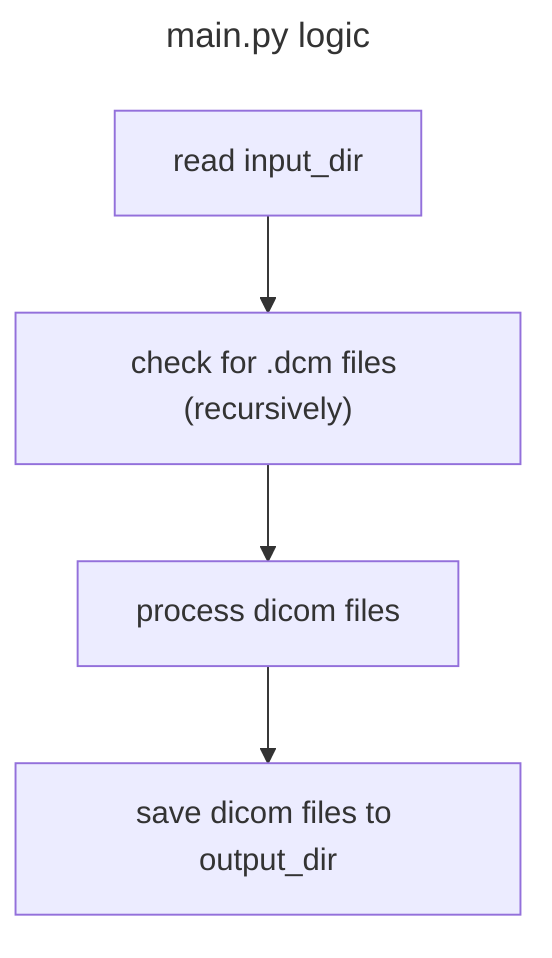

# Hello world DICOM

Sample containerised PyTorch application for processing DICOM files, compatible with the Newton's Tree Platform (NTP).

## Example logic



## 1. Define your Dockerfile

See [Dockerfile](Dockerfile).

## 2. Build your container

```bash
version=0.2.4
docker build -t hello-world:$version .
```

## 3. Test your container

> Your container will be run on the Newton's Tree Platform, but you can test your container locally before deployment:

* The paths in the container `/data/in` and `/data/out` are mounted locally in this example as `dicom/in` and `dicom/out`
* We set the user to uid 999 which is non-privileged, as this replicates the deployment environment

```bash
docker run --rm \
  -u 999 \
  -v $(pwd)/dicom/in:/data/in \
  -v $(pwd)/dicom/out:/data/out \
  hello-world:$version
```

In a deployment, the Newton's Tree Platform will receive and mount DICOM files to the required mount paths (`/data/in` in this example). ℹ️ Note these may include nested folders.